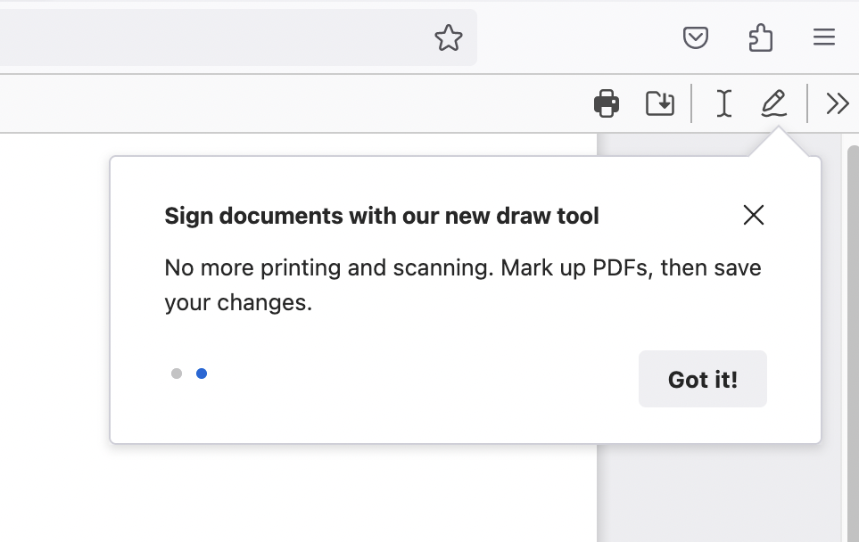
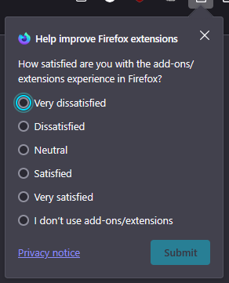

# Feature Callout

## Table of Contents

- [Feature Callouts](#feature-callouts)
  - [Content Elements](#content-elements)
  - [Arrow Positioning](#arrow-positioning)
- [Use Cases](#use-cases)
- [Examples](#examples)
- [Testing Feature Callouts](#testing-feature-callouts)
  - [Via The DevTools](#via-the-devtools)
  - [Via Local Provider](#via-local-provider)
  - [Via Experiments](#via-experiments)
- [Schema](#schema)
- [Example JSON](#example-json)
- [Targeting](#targeting)
  - [Targeting Considerations](#targeting-considerations)
- [Triggers](#triggers)
- [Special Message Actions](#special-message-actions)

## Feature Callouts

Feature Callouts point to and describe features in content pages or the browser chrome. They can consist of a single message or of a sequence of messages. Callouts are different from [Spotlights](./spotlight.md) or other dialogs in that they do not block other interactions with the browser. Feature Callouts are currently only available for experimentation in the browser chrome. For example, callouts can easily be configured to point to toolbar buttons in the browser chrome.

### Content Elements

Callouts may be configured with the following content elements (each of which is optional):

- title
- subtitle
- inline title icon
- a large illustration above the title
- primary action button
- secondary action button
- additional action button
- dismiss button
- checkboxes and/or radio buttons

### Arrow Positioning

The callout's arrow (the triangle-shaped caret pointing to the anchor) can be positioned in the middle or in the corners of any of the callout's edges, and it can be anchored to the same positions on its anchor element. The arrow position and anchor position can each be placed at the start, middle, or end of any given side of the callout or anchor respectively. Although the syntax for arrow and anchor positioning includes "left" and "right", the positions will be adjusted appropriately for left-to-right text directions, and this should be configured as if for right-to-left text directions. The arrow can also be hidden entirely. There is also an optional effect to highlight the button the callout is anchored to. This highlight only works if the anchor element is a button.

## Use Cases

Feature Callouts have been used in a variety of ways. Some common use cases are:

- Highlighting underused functionality
- Displaying short surveys
- Displaying informative toast messages
- Guiding users through new features

## Examples

A Feature Callout highlighting a feature



A Feature Callout displaying a user feedback survey



## Testing Feature Callouts

### Via the devtools:

1. Go to `about:config`, set pref `browser.newtabpage.activity-stream.asrouter.devtoolsEnabled` to `true`
2. Open a new tab and go to `about:asrouter` in the urlbar
3. In the devtools Messages section, search for `feature_callout` using the findbar
4. You should see an example JSON message labeled `TEST_FEATURE_TOUR`. Clicking `Show` next to it should show the callout
5. You can directly modify the message in the text area with your changes or by pasting your custom message JSON. Clicking `Modify` shows your updated message. Make sure it's valid JSON and be careful not to add unnecessary commas after the final member in an array or the final property of an object, as they will invalidate the message.
6. For these testing purposes, targeting and trigger are ignored, as the message will be triggered by pressing the "Modify" button. So you won't be able to test triggers and targeting by this method.
7. Ensure that all required properties are covered according to the schema below
8. Clicking `Share` copies a link to your clipboard that can be pasted in the urlbar to preview the message and can be shared to get feedback from your team

- **Note:** Only one Feature Callout can be shown at a time. You must dismiss existing callouts before new ones can be shown.

### Via local provider:

You can also test Feature Callouts by adding them to the [local provider](https://searchfox.org/firefox-main/source/browser/components/asrouter/modules/FeatureCalloutMessages.sys.mjs). While slower than using the devtools, this is useful when you want to test the trigger or targeting, or when your callout's anchor is an element that is not visible while on `about:asrouter` (such as a urlbar button).

### Via Experiments:

You can test Feature Callouts by creating an experiment or landing message in tree. [Messaging Journey](https://experimenter.info/messaging/desktop-messaging-journey) captures creating and testing experiments via Nimbus. This is the most time-consuming method, but if your callout will be launched as an experiment, then it also provides the most accurate preview.

## Schema

```ts
interface FeatureCallout {
  // Unique id for the message. Used to store impressions, recorded in telemetry
  id: string;
  template: "feature_callout";
  // Targeting expression string. JEXL is used for evaluation. See the Targeting
  // section below for details.
  targeting: string;
  // Trigger object. See the Triggers section below for details.
  trigger: {
    // The trigger's unique identifier, e.g. "nthTabClosed".
    id: string;
    // A set of parameters for the triggers. Usage depends on the trigger id.
    params?: any;
    // A set of URL match patterns (like globs) used by some triggers.
    // See https://developer.mozilla.org/en-US/docs/Mozilla/Add-ons/WebExtensions/Match_patterns
    patterns?: string[];
  };
  // An optional object specifying frequency caps for the message.
  frequency?: {
    // A basic limit on the number of times the message can be shown to a user
    // across the entire lifetime of the user profile.
    lifetime?: number;
    // An array specifying any number of limits on the number of times the
    // message can be shown to a user within a specific time period. This can be
    // specified in addition to or instead of a lifetime limit.
    custom?: Array<{
      // The number of times the message can be shown within the period.
      cap: number;
      // The period of time in milliseconds. For example, 24 hours is 86400000.
      period: number;
    }>;
  };
  // An array of message groups, which are used for frequency capping. Typically
  // this should be ["cfr"], unless you have a specific reason to do otherwise.
  groups?: string[];
  // Messages can optionally have a priority or weight, influencing the order in
  // which they're shown. Higher priority messages are shown first. Messages can
  // also be selected randomly based on their weight. However, weight is rarely
  // used. We recommend using neither weight nor priority, unless you are adding
  // multiple messages with the same trigger and similar targeting.
  weight?: number; // e.g. weight: 200 is more likely than weight: 100
  priority?: number; // e.g. priority: 2 beats priority: 1
  // Whether the message should be skipped in automated tests. If omitted, the
  // message can be shown in tests. A truthy value will skip the message in
  // tests. The value should be a string explaining why the message needs to be
  // skipped. You can still test messages with this property in automation by
  // stubbing `ASRouter.messagesEnabledInAutomation` (adding the message id to
  // the array). This way, you can avoid showing the message in all tests except
  // the specific test where you want to test it. This has no effect for
  // messages in Nimbus experiments. It's for local messages only.
  skip_in_tests?: string;
  content: {
    // Must match the top-level id above.
    id: string;
    template: "multistage";
    backdrop: "transparent";
    transitions: false;
    // Set to true to apply the write-in microsurvey data policy. This is
    // REQUIRED for all write-in microsurveys. Messages using the textarea tile
    // should always set this to true. It prevents `client_id` from being
    // recorded with any telemetry events for the message, recording a unique
    // `impression_id` instead. It also sends the events on the `microsurvey`
    // ping instead of the `messaging-system` ping, which is anonymized by
    // OHTTP, has stricter access control and is retained for a shorter period.
    // It still allows counting unique impressions and joining pings from the
    // same message, but it can't be joined to any other telemetry data. So all
    // events coming from a message with this set to true will be joinable by
    // `impression_id`, but disconnected from other datasets. Optional; defaults
    // to false if omitted.
    write_in_microsurvey?: boolean;
    disableHistoryUpdates: true;
    // The name of a preference that will be used to store screen progress. Only
    // relevant if your callout has multiple screens and serves as a tour. This
    // allows tour progress to persist across sessions and even devices, if the
    // pref is synced via FxA. In most cases, this will not be needed. A tour
    // pref name allows a callout's SET_PREF actions to advance screens or
    // dismiss the callout. Optional, as `advance_screens` and `dismiss` handle
    // progress too. Tour prefs allow resuming from the same screen after
    // dismissal or restart, or even syncing progress across devices. Pref names
    // must be in `SpecialMessageActions.sys.mjs#allowedPrefs` or start with
    // "messaging-system-action." (e.g., "messaging-system-action.tour1").
    tour_pref_name?: string;
    // A default value for the pref. Can be used if the pref is not set in
    // Firefox's default prefs. This is the default value that will be used
    // until the pref is set by the user interacting with the callout. It will
    // be used to determine the starting screen. Values are JSON objects like
    // this: { "screen": "SCREEN_1", "complete": false }
    // The "screen" property is the id of the screen to start on, and the
    // "complete" property is a boolean indicating whether the tour has been
    // completed (it should always be false here). As with tour_pref_name, this
    // should usually be omitted.
    tour_pref_default_value?: string;
    // Set to "block" to block all telemetry. Recommended to omit this.
    metrics?: string;
    // An array of screens that should be shown in sequence. The first screen
    // will be shown immediately. If the screen includes actions (such as
    // `primary_button.action`) with `navigate: true`, the user can advance to
    // the next screen, causing the first screen to fade out and the next screen
    // to fade in.
    screens: Array<{
      // A unique screen ID recorded in impression telemetry. Each screen in a
      // message should have a different ID, which can be referenced in actions
      // to update the tour pref and advance screens.
      id: string;
      // Feature callouts with multiple screens show a series of dots at the
      // bottom, indicating which screen the user is on. This property allows
      // you to hide those dots. The steps indicator is already hidden if
      // there's only one screen, since it's unnecessary. Defaults to false.
      force_hide_steps_indicator?: boolean;
      // An array of anchor objects. Each anchor object represents a single
      // element on the page that the callout should be anchored to. The
      // callout will be anchored to the first visible element in the array.
      anchors: [
        {
          // A CSS selector for the element to anchor to. The callout will be
          // anchored to the first visible element that matches this selector.
          // This supports a special token %triggerTab% that functions as a
          // selector for the tab that triggered the callout, usually (but not
          // always) the selected tab. It can be placed at any position in the
          // selector, like other tokens. For example:
          // "#tabbrowser-tabs %triggerTab%[visuallyselected] .tab-icon-image"
          // This also supports a special ::%shadow% token that allows
          // traversing into shadow DOM roots. This is required for some
          // applications, such as anchoring callouts to elements inside
          // shadow DOM components. It can be chained across multiple shadow
          // DOM layers. For example:
          // "#sidebar-main > sidebar-main::%shadow%
          //  .tools-and-extensions::%shadow%
          //  moz-button[view='viewReviewCheckerSidebar']"
          // This also supports a special token ::%document% that allows
          // traversing into a content document, such as an iframe. It
          // can be chained with ::%shadow% to cross both document and
          // shadow DOM boundaries. For example:
          // "hbox.deck-selected browser::%document%
          //  ai-window::%shadow%context-icon-button"
          selector: string;
          // panel_position is an object representing how the callout should be
          // positioned relative to the anchor element.
          //
          // Note that the arrow position depends on the *combination* of both
          // anchor_attachment and callout_attachment. For example, if the
          // anchor_attachment is bottomcenter and the callout_attachment is
          // topright, the arrow will be attached to the top edge of the
          // callout, but towards the right side of that edge. But if
          // anchor_attachment is changed to leftcenter, then the same
          // callout_attachment of topright would put the arrow on the right
          // edge of the callout, towards the top. It's easy to make a
          // mistake, so you should always test your anchors.
          //
          // Note that horizontal attachment points are reversed in RTL mode
          // (right-to-left scripts like Arabic). "leftcenter rightcenter"
          // would put the callout to the left of the anchor in LTR, but to
          // the right of the anchor in RTL. "bottomcenter topright" would put
          // the callout under the anchor and flowing to the left in LTR, but
          // under the anchor and flowing to the right in RTL.
          panel_position: {
            // The point on the anchor that the callout should be tied to. See
            // PopupAttachmentPoint below for the possible values. These are the
            // same values used by XULPopupElement.
            anchor_attachment: PopupAttachmentPoint;
            // The point on the callout that should be tied to the anchor.
            callout_attachment: PopupAttachmentPoint;
            // The flip behavior to apply to the panel when it would overflow
            // the screen. "slide" makes the panel slide in the direction it's
            // overflowing, to keep it on screen. If it overflows in the same
            // direction it's aligned relative to the anchor, it will flip in
            // that direction. This is the default behavior. "none" just allows
            // the panel to bleed out of bounds, without flipping or sliding.
            flip?: "slide" | "none";
            // Offsets in pixels to apply to the callout position in the
            // horizontal and vertical directions. Generally not needed.
            offset_x?: number;
            offset_y?: number;
          };
          // Hide the arrow that points from the callout to the anchor?
          hide_arrow?: boolean;
          // Whether to apply the [open] style to the anchor element when the
          // callout is shown. Relevant for elements like buttons with an [open]
          // style that adds shading, similar to :active. False to apply the
          // style, true to skip it.
          no_open_on_anchor?: boolean;
          // The desired width of the arrow in a number of pixels. 33.94113 by
          // default (this corresponds to a triangle with 24px edges). This
          // also affects the height of the arrow.
          arrow_width?: number;
          // The desired distance between the arrow and the corner of the parent
          // box element. A number of pixels. Default is 12px.
          arrow_corner_distance?: number;
          // By default, callouts are not focused when they are shown. The user
          // must use a mouse or the F6 shortcut to interact with the callout.
          // This property allows you to force an element inside the callout to
          // be focused when the callout is shown. Use sparingly, as it can make
          // callouts much more disruptive for users.
          autofocus?: AutoFocusOptions;
        },
      ];
      content: {
        position: "callout";
        // By default, callouts don't hide if the user clicks outside of them.
        // Set this to true to make the callout hide on outside clicks.
        autohide?: boolean;
        // By default, hitting Escape will dismiss the callout, whether it is
        // focused or not. Setting this to true will stop keypresses from
        // dispatching up to the callout from outside it, though they will
        // still work when the callout is focused. Best to leave this as-is.
        ignorekeys?: boolean;
        // Callout card width as a CSS value, e.g. "400px" or "min-content".
        // Defaults to "400px".
        width?: string;
        // Callout card padding as a CSS value, e.g. "12px 16px" or "1em".
        // Defaults to "16px".
        padding?: number;
        // Callouts normally have a vertical layout, with rows of content. If
        // you want a single row with a more inline layout, you can use this
        // property, which works well in tandem with title_logo.
        layout?: "inline";
        // An optional object representing a large illustration to show above
        // other content. See Logo below for the possible properties.
        logo?: Logo;
        // The callout's headline. This is optional but commonly used. Can be
        // a raw string or a LocalizableThing (see interface below).
        title?: Label;
        // An optional object representing an icon to show next to the title.
        // See TitleLogo below for the possible properties.
        title_logo?: TitleLogo;
        // A subtitle to show below the title. Typically a longer paragraph.
        subtitle?: Label;
        primary_button?: {
          // Text to show inside the button.
          label: Label;
          // Buttons can optionally show an arrow icon, indicating that
          // clicking the button will advance to the next screen.
          has_arrow_icon?: boolean;
          // Buttons can be disabled. The boolean option isn't really useful,
          // since there's no logic to enable the button. However, if your
          // screen uses the "multiselect" tile (see tiles), you can use
          // "hasActiveMultiSelect" to disable the button until the user
          // selects something. If your screen has a textarea tile, you can use
          // "hasTextInput" to disable the button while the textarea is empty or
          // exceeds the character limit. If your screen uses a "single-select"
          // tile, you can use "hasActiveSingleSelect" to disable the primary
          // button until the user selects an option.
          disabled?: boolean | "hasActiveMultiSelect" | "hasActiveSingleSelect" | "hasTextInput";
          // Primary buttons can have a "primary" or "secondary" style. This
          // is useful because you can't change the order of the buttons, but
          // you can swap the primary and secondary buttons' styles.
          style?: "primary" | "secondary";
          // The action to take when the button is clicked. See Action below.
          action: Action;
        };
        secondary_button?: {
          label: Label;
          // Extra text to show before the button.
          text: Label;
          has_arrow_icon?: boolean;
          disabled?: boolean | "hasActiveMultiSelect" | "hasTextInput";
          style?: "primary" | "secondary";
          action: Action;
        };
        additional_button?: {
          label: Label;
          // If you have several buttons, you can use this property to control
          // the orientation of the buttons. By default, buttons are laid out
          // in a complex way. Use row or column to override this.
          flow?: "row" | "column";
          disabled?: boolean;
          // The additional button can also be styled as a link.
          style?: "primary" | "secondary" | "link";
          action: Action;
          // Justification/alignment of the buttons row/column. Defaults to
          // "end" (right-justified buttons). You can use space-between if,
          // for example, you have 2 buttons and you want one on the left and
          // one on the right.
          alignment?: "start" | "end" | "space-between";
        };
        dismiss_button?: {
          // This can be used to control the ARIA attributes and tooltip.
          // Usually it's omitted, since it has a correct default value.
          label?: Label;
          // The button can be 20px, 24px or 32px. Defaults to 32px.
          size?: "x-small" | "small" | "large";
          action: Action;
          // CSS overrides.
          marginBlock?: string;
          marginInline?: string;
        };
        // A split button is an additional_button or secondary_button split
        // into 2 buttons: one that performs the main action, and one with an
        // arrow that opens a dropdown submenu (which this property controls).
        submenu_button?: {
          // This defines the dropdown menu that appears when the user clicks
          // the split button.
          submenu: SubmenuItem[];
          // The submenu button can only be a split button, so a secondary or
          // additional button needs to exist for it to attach to.
          attached_to: "secondary_button" | "additional_button";
          // Used mainly to control the ARIA label and tooltip (tooltips are
          // currently broken), but can also be used to override CSS styles.
          label?: Label;
          // Whether the split button should follow the primary or secondary
          // button style. Set this to the same style you specified for the
          // button it's attached to. Defaults to "secondary".
          style?: "primary" | "secondary";
        };
        // Predefined content modules. These are poorly documented but can be
        // investigated in ContentTiles.jsx. The example here is a multiselect
        // tile, which shows a list of checkboxes or radio buttons.
        tiles?: {
          type: "multiselect";
          data: MultiSelectItem[];
          // Allows CSS overrides of the multiselect container.
          style?: {
            color?: string;
            fontSize?: string;
            fontWeight?: string;
            letterSpacing?: string;
            lineHeight?: string;
            marginBlock?: string;
            marginInline?: string;
            paddingBlock?: string;
            paddingInline?: string;
            whiteSpace?: string;
            flexDirection?: string;
            flexWrap?: string;
            flexFlow?: string;
            flexGrow?: string;
            flexShrink?: string;
            justifyContent?: string;
            alignItems?: string;
            gap?: string;
            // Any CSS properties starting with "--" are also allowed, to
            // override CSS variables used in _feature-callout.scss.
            "--some-variable"?: string;
          };
        };
        tiles_container: {
          // Position of the tiles container relative to supporting content
          // like `above_button_content`. By default, it comes before supporting
          // content. Setting to "after_supporting_content" places it after.
          position?: null | "after_supporting_content";
          style?: {
            padding: string;
            margin: string;
            marginBlock: string;
            marginInline: string;
            paddingBlock: string;
            paddingInline: string;
            flexDirection: string;
            flexWrap: string;
            flexFlow: string;
            flexGrow: string;
            flexShrink: string;
            justifyContent: string;
            alignItems: string;
            gap: string;
          };
        };
        // The dots in the corner that show what screen you're on and how many
        // screens there are in total. This property is only used to override
        // the ARIA attributes or tooltip. Not recommended.
        steps_indicator?: {
          string_id: string;
        };
        // An extra block of configurable content below the title/subtitle but
        // above the main buttons. Can be placed above the `tiles` by setting
        // `tiles_container.position` to "after_supporting_content".
        above_button_content?: LinkParagraphOrImage[];
        // An optional array of event listeners to add to the page where the
        // feature callout is shown. This can be used to perform actions in
        // response to interactions and other events outside of the feature
        // callout itself. The prototypical use case is dismissing the feature
        // callout when the user clicks the button the callout is anchored to.
        // It also supports performing actions on a timeout/interval.
        page_event_listeners?: Array<{
          params: {
            // Event type string, e.g. "click". This supports:
            // 1. Any DOM event type
            // 2. "timeout" and "interval" for timers
            // 3. Internal feature callout events: "touradvance" and
            //    "tourend". This can be used to perform actions when the user
            //    advances to the next screen or finishes the callout tour.
            type: string;
            // Target selector, e.g. `tag.class, #id[attr]` - Not needed for
            // all types.
            selectors?: string;
            // addEventListener options
            options: {
              // Handle events in capturing phase?
              capture?: boolean;
              // Remove listener after first event?
              once?: boolean;
              // Prevent default action in event handler?
              preventDefault?: boolean;
              // Used only for `timeout` and `interval` event types. These
              // don't set up real event listeners, but instead invoke the
              // action on a timer.
              interval?: number;
              // Extend addEventListener to all windows? Not compatible with
              // `interval`.
              every_window: boolean;
            };
          };
          action: {
            // One of the special message action ids.
            type?: "string";
            // Data to pass to the action. Depends on the action.
            data?: any;
            // Dismiss screen after performing action? If there's no type, the
            // action will *only_ dismiss the callout.
            dismiss?: boolean;
          };
        }>;
        // An action to perform when the Escape key is pressed, or when a page
        // event listener invokes an action containing `dismiss: true`.
        // Unnecessary if your message has a dismiss_button.
        dismiss_action?: Action;
      };
    }>;
    // Specify the index of the screen to start on. Generally unused.
    startScreen?: number;
  };
}

// Each attachment point corresponds to an attachment point on the edge of a
// frame. For example, "topleft" corresponds to the frame's top left corner, and
// "rightcenter" corresponds to the center of the right edge of the frame.
//
// @see nsMenuPopupFrame for the canonical alignment points. We also add some
// aliases based on cardinal directions (like on a compass) to make it easier to
// reason about. So north is equivalent to topcenter, southwest is equivalent to
// bottomleft, etc.
type PopupAttachmentPoint =
  | "topleft"
  | "topright"
  | "bottomleft"
  | "bottomright"
  | "leftcenter"
  | "rightcenter"
  | "topcenter"
  | "bottomcenter"
  | "north"
  | "south"
  | "west"
  | "east"
  | "northwest"
  | "northeast"
  | "southwest"
  | "southeast";

interface AutoFocusOptions {
  // A preferred CSS selector, if you want a specific element to be focused. If
  // omitted, the default prioritization listed below will be used, based on
  // `use_defaults`.
  // Default prioritization: primary_button, secondary_button, additional_button
  //   (excluding pseudo-links), dismiss_button, <input>, any button.
  selector?: string;
  // Whether to use the default element prioritization. If `selector` is
  // provided and the element can't be found, and this is set to false, nothing
  // will be selected. If `selector` is not provided, this must be true.
  // Defaults to true.
  use_defaults?: boolean;
}

type Label = string | LocalizableThing;

interface LocalizableThing {
  // A raw, untranslated string, typically used for EN-only experiments.
  raw?: string;
  // A Fluent string id from a .ftl file.
  string_id?: string;
  // Arguments to pass to Fluent. Used for Fluent strings that have variables.
  args?: {
    [key: string]: string;
  };
  // A string to use as the element's aria-label attribute value.
  aria_label?: string;
  // CSS overrides.
  color?: string;
  fontSize?: string;
  fontWeight?: string;
  letterSpacing?: string;
  lineHeight?: string;
  marginBlock?: string;
  marginInline?: string;
  paddingBlock?: string;
  paddingInline?: string;
  whiteSpace?: string;
}

interface Logo {
  imageURL: "chrome://branding/content/about-logo.svg";
  darkModeImageURL: string;
  reducedMotionImageURL: string;
  darkModeReducedMotionImageURL: string;
  //  alt text. Defaults to ""
  alt: string;
  // CSS style overrides for the icon.
  width: string;
  height: string;
  marginBlock: string;
  marginInline: string;
}

interface TitleLogo extends Logo {
  // Logo alignment relative to the title. Use "top" if you have multiple rows
  // of text and you want the logo aligned to the top row. Defaults to "center".
  alignment: "top" | "bottom" | "center";
}

// Click the Special Message Actions link at the bottom of the page.
interface Action {
  // One of the special message action ids.
  type?: "string";
  // Data to pass to the action. Depends on the action.
  data?: any;
  // Set to true if you want the action to dismiss the callout/tour. Can be used
  // in addition to, or instead of, a special message action type. Set to
  // "actionResult" if you want the callout to only be dismissed after the
  // special message action has resolved successfully. "actionResult" will only
  // take effect for certain special message action ids, and it requires setting
  // `needsAwait` to true. It is rarely used in the feature callout surface.
  dismiss?: boolean | "actionResult";
  // Indicates that the action should navigate to a different screen.
  advance_screens?: {
    // As with dismiss, this can be set to true to take effect immediately, or
    // set to "actionResult" to only advance screens after the special message
    // action has resolved successfully. Defaults to true.
    behavior?: boolean | "actionResult";
    // How many screens, and in which direction, to advance. Positive integers
    // advance forward, negative integers advance backward. Must be an integer.
    // If advancing by the specified number of screens would take you beyond the
    // last screen, it will end the tour, just like if you used `dismiss: true`.
    // If it's a negative integer that advances beyond the first screen, it will
    // stop at the first screen.
    direction?: number;
    // The id of the screen to advance to. If both id and direction are provided
    // (which they shouldn't be), the id takes priority. Either id or direction
    // is required. Passing the special token `%end%` ends the tour.
    id?: string;
  };
  // Set to true if this action is for the primary button and you're using the
  // "multiselect" tile. This is what allows the primary button to perform the
  // actions specified by the user's checkbox/radio selections. It will combine
  // all the actions for all the selected checkboxes/radios into this action's
  // data.actions array, and perform them in series.
  collectSelect?: boolean;
  // Setting this to true will require the special message action (given by the
  // type property above) to successfully resolve before dismissing the callout
  // or advancing screens. This requires dismiss or advance_screens.behavior to
  // be "actionResult", or it will have no effect.
  needsAwait?: boolean;
}

// Either an image or a paragraph that supports inline links. Inline links can
// be expressed in two ways:
//   1. A single Fluent-localized string paired with `link_keys`. Each key
//      corresponds to an `<a data-l10n-name="…">` marker inside the Fluent
//      string. This is the original mode and requires Fluent.
//   2. An array of text/link segments assigned to `text`. Segments can be
//      raw strings, embedded URLs (`href`), or inline `link_key` references
//      that look up actions on `screen.content`. This mode supports raw
//      strings (no Fluent required) and is the recommended shape for
//      paragraphs that mix prose with one or more inline links.
interface LinkParagraphOrImage extends Logo {
  // Which type of content this is.
  type: "image" | "text";

  // Each of the following is only used if `type` is "text".

  // The paragraph text. One of:
  //
  // - A `LocalizableThing` for mode (1). Combine with `link_keys` to attach
  //   actions to the `<a data-l10n-name="…">` markers in the Fluent string.
  //
  // - An array of segments for mode (2). Each segment is either:
  //     * a raw string (rendered as plain text), or
  //     * a `LocalizableThing` with `href` (and optional `where`), rendered
  //       as a real link that, when clicked, calls `preventDefault()` and
  //       dispatches the OPEN_URL special message action with
  //       `{ args: href, where: where ?? "tab" }`. `where` accepts the same
  //       values as OPEN_URL (e.g. "tab", "tabshifted", "window").
  //     * a `LocalizableThing` with `link_key`, rendered as an inline link
  //       whose action is looked up from `screen.content[link_key].action`
  //       (the same mechanism that mode (1)'s `link_keys` uses, but
  //       anchored to an explicit segment — so it works with raw text and
  //       does not need a `<a data-l10n-name>` marker in a Fluent string).
  //     * a `LocalizableThing` with neither, rendered as a localized span.
  //   Because each segment can itself be a `LocalizableThing`, segments
  //   carry their own per-segment CSS overrides and `aria_label`. CSS
  //   overrides set on `LinkParagraphOrImage` itself (e.g. `textAlign`,
  //   `fontSize`, `marginBlock`) are applied to the surrounding `<p>`.
  text: LocalizableThing | Array<
    | string
    | (LocalizableThing & {
        // Embedded URL link. Dispatches OPEN_URL with `args: href`.
        href?: string;
        // OPEN_URL `where` argument. Defaults to "tab". Only meaningful
        // alongside `href`.
        where?: string;
        // Inline link key. Resolved against `screen.content[link_key].action`.
        // Mutually exclusive with `href`; if both are set, `href` wins.
        link_key?: string;
      })
  >;
  // Only used in mode (1). Each link key must exist in screen.content. For
  // example, if link_keys is ["learn_more"], then there must be a key named
  // "learn_more" in screen.content. The value of that key must be an object
  // with an `action` property (which is an Action). Moreover, the string_id in
  // the `text` object (see the property above) must refer to a Fluent string
  // that contains an anchor element with `data-l10n-name="learn_more"`, e.g.:
  //   my-string = Do the thing! <a data-l10n-name="learn_more">Learn more</a>
  // Ignored when `text` is an array — in that mode, link keys are specified
  // per-segment via `link_key` on individual segment objects.
  link_keys?: string[];
  // Optional paragraph style. If "legal", the paragraph is rendered with a
  // smaller, secondary-text style (`.legal-paragraph`). Otherwise it uses the
  // default style (`.link-paragraph`).
  font_styles?: "legal";
}

interface MultiSelectItem {
  // A unique id for this item, distinguishing it from other items.
  id: string;
  type: "checkbox" | "radio";
  // Radios need to be members of radio groups to work properly. Set the same
  // group for your radios to make sure only one can be selected at a time.
  group?: string;
  // Set to true to make it selected/checked by default.
  defaultValue: false;
  label?: Label;
  // By default, multiselect items appear in the order they're listed
  // in the data array. Set this to true to randomize the order. This
  // is most commonly used to randomize the order of answer choices
  // for a survey question, to avoid the first-choice bias.
  // Instead of randomizing the entire set, we randomize specific
  // items. Any adjacent items with randomize will be randomized in-place. So
  // if there are 4 items with randomize, followed by 1 nonrandom item, the 4
  // will be randomized but the 5th will stay at the bottom.
  randomize?: boolean;
  // CSS overrides for the div box containing the item and its optional label.
  style?: {
    color?: string;
    fontSize?: string;
    fontWeight?: string;
    letterSpacing?: string;
    lineHeight?: string;
    marginBlock?: string;
    marginInline?: string;
    paddingBlock?: string;
    paddingInline?: string;
    whiteSpace?: string;
    flexDirection?: string;
    flexWrap?: string;
    flexFlow?: string;
    flexGrow?: string;
    flexShrink?: string;
    justifyContent?: string;
    alignItems?: string;
    gap?: string;
  };
  // You can replace the checkbox check/radio circle with an icon by using a
  // bunch of CSS overrides.
  icon?: {
    style: {
      color?: string;
      fontSize?: string;
      fontWeight?: string;
      letterSpacing?: string;
      lineHeight?: string;
      marginBlock?: string;
      marginInline?: string;
      paddingBlock?: string;
      paddingInline?: string;
      whiteSpace?: string;
      width?: string;
      height?: string;
      background?: string;
      backgroundColor?: string;
      backgroundImage?: string;
      backgroundSize?: string;
      backgroundPosition?: string;
      backgroundRepeat?: string;
      backgroundOrigin?: string;
      backgroundClip?: string;
      border?: string;
      borderRadius?: string;
      appearance?: string;
      fill?: string;
      stroke?: string;
      outline?: string;
      outlineOffset?: string;
      boxShadow?: string;
    };
  };
  // The action is not performed until the user clicks the primary button.
  action: Action;
}

interface SubmenuItem {
  // Submenus can have 3 types of items, just like normal menupopups
  // in Firefox.
  type: "action" | "menu" | "separator";
  // The id is used to identify the submenu item in telemetry.
  id?: string;
  label: Label;
  // Used only for type "action". The action to perform when the
  // submenu item is clicked.
  action?: Action;
  // Used only for type "menu". The submenu items to show when the
  // user hovers over this item. This is a recursive structure.
  submenu: SubmenuItem[];
  // An optional URL specifying an icon to show next to the label.
  icon?: string;
}
```

## Example JSON

```json
{
  "id": "TEST_FEATURE_TOUR",
  "template": "feature_callout",
  "groups": [],
  "targeting": "true",
  "content": {
    "id": "TEST_FEATURE_TOUR",
    "template": "multistage",
    "backdrop": "transparent",
    "transitions": false,
    "disableHistoryUpdates": true,
    "screens": [
      {
        "id": "FEATURE_CALLOUT_1",
        "anchors": [
          {
            "selector": "#PanelUI-menu-button",
            "panel_position": {
              "anchor_attachment": "bottomcenter",
              "callout_attachment": "topright"
            }
          }
        ],
        "content": {
          "position": "callout",
          "title": {
            "raw": "Panel Feature Callout"
          },
          "subtitle": {
            "raw": "Hello!"
          },
          "primary_button": {
            "label": {
              "raw": "Advance"
            },
            "action": {
              "navigate": true
            }
          },
          "dismiss_button": {
            "action": {
              "dismiss": true
            }
          }
        }
      }
    ]
  }
}
```

## Targeting

Messages use JEXL targeting expressions to determine whether the user is eligible to see the message. See [Guide to targeting with JEXL](./targeting-guide.md) and [Targeting attributes](./targeting-attributes.md) for details.

### Targeting Considerations

In almost all cases, targeting should prevent the Feature Callout from showing up while other notifications are being displayed and also prevent it from showing up when the browser is first started after a major upgrade. The JEXL expressions are `!activeNotifcations` and `!isMajorUpgrade` for these scenarios respectively.

Feature Callouts are also often used to contextually recommend new features to users. In these cases, the JEXL expression `userPrefs.cfrFeatures` should be included in the targeting to prevent the Callout from appearing for users who have turned contextual feature recommendations off. It is also common to add `previousSessionEnd` to the targeting to ensure that users opening the browser for the first time ever don't see the message on their first run.

## Triggers

Triggers are used to determine when a message should be shown. See [Trigger Listeners](/toolkit/components/messaging-system/docs/TriggerActionSchemas/index.md) for details.

## Special Message Actions

Buttons, links, and other calls to action can use one or more of a set of predefined actions. [Click here](/toolkit/components/messaging-system/docs/SpecialMessageActionSchemas/index.md) for a full list of valid actions.
