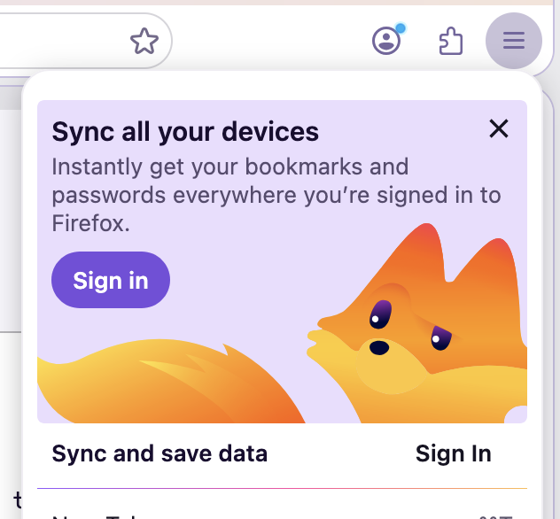
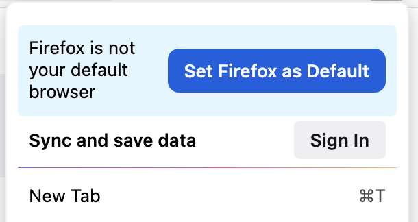
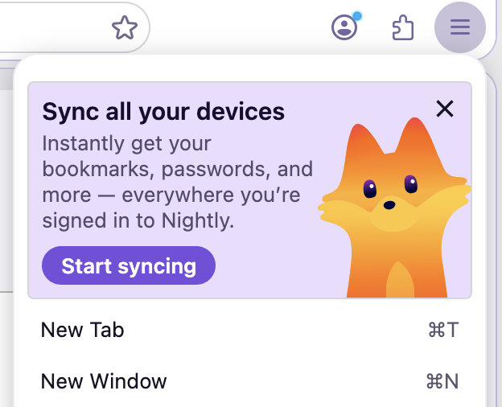

# MenuMessage

MenuMessage displays a contextual call-to-action card inside Firefox's panel menus: the App Menu (hamburger) and the PXI Menu (Firefox Accounts avatar panel).


## Surfaces

| Surface | `testingTriggerContext` | Supported `messageType` |
|---------|------------------------|------------------------|
| App Menu | `app_menu` | `fxa_cta`, `default_cta` |
| PXI Menu | `pxi_menu` | `fxa_cta` only |

## Message Types

- **`fxa_cta`**: Firefox Accounts sign-in prompt. Hidden for signed-in users unless `allowWhenSignedIn: true`. Available in both the App Menu and PXI Menu.
- **`default_cta`**: General CTA. App Menu only. Always shown regardless of sign-in state.

## Layouts


- **`column`** (default): Illustration above text with a button stack below. Set `imagePosition: "bottom"` to render the illustration full-bleed at the bottom of the card instead.

- **`row`**: Text on the left, button and illustration on the right.

- **`simple`**: Single row with primary text and button only — no image, secondary text or close button.

- **`split`**: Two-column layout (illustration and copy). Use `imagePosition` `"start"` or `"end"` to swap which side the illustration sits on and `"bottom"` to have it aligned block-end. Default is `"end"`.

## Testing Menu Messages
Previewing the layout options and configurations can be done through `./mach storybook` or through `about:asrouter`, as seen below. See the [MenuMessage Schema](https://searchfox.org/mozilla-central/source/browser/components/asrouter/content-src/templates/OnboardingMessage/MenuMessage.schema.json) for the available configuration options.

### Using ASRouter devtools:
1. Set `browser.newtabpage.activity-stream.asrouter.devtoolsEnabled` to `true` in `about:config`
2. Go to `about:asrouter`
3. Select `panel` as the provider and find messages with `"template": "menu_message"`
4. Click **Show** — the `testingTriggerContext` field on the message determines which menu surface is simulated (`app_menu` or `fxa_cta`).
5. Paste custom JSON in the text area and click **Modify** to preview changes

### Example JSON

```json
{
    "id": "EXAMPLE_PXI_MENU_SPLIT_LAYOUT",
    "template": "menu_message",
    "content": {
        "layout": "split",
        "messageType": "fxa_cta",
        "primaryText": {
            "string_id": "fxa-menu-message-sync-devices-primary-text"
        },
        "secondaryText": {
            "string_id": "fxa-menu-message-sync-devices-secondary-text2"
        },
        "primaryActionText": {
            "string_id": "fxa-menu-message-sign-in-button"
        },
        "imageURL": "chrome://browser/content/asrouter/assets/kit-peek.svg",
        "imageVerticalBottomOffset": -8,
        "imagePosition": "bottom",
        "imageWidth": 95,
        "primaryAction": {
            "type": "FXA_SIGNIN_FLOW",
            "data": {
                "where": "tab",
                "autoClose": false
            }
        },
        "closeAction": {
            "type": "BLOCK_MESSAGE",
            "data": {
                "id": "EXAMPLE_PXI_MENU_SPLIT_LAYOUT"
            }
        }
    },
    "trigger": {
        "id": "menuOpened"
    },
    "testingTriggerContext": "pxi_menu",
    "groups": [],
}
```

## Schema

[MenuMessage.schema.json](https://searchfox.org/mozilla-central/source/browser/components/asrouter/content-src/templates/OnboardingMessage/MenuMessage.schema.json)

## Related Docs

- [Targeting attributes](https://firefox-source-docs.mozilla.org/toolkit/components/messaging-system/docs/targeting-attributes.html)
- [Triggers](https://firefox-source-docs.mozilla.org/toolkit/components/messaging-system/docs/TriggerActionSchemas/index.html)
- [Special Message Actions](https://firefox-source-docs.mozilla.org/toolkit/components/messaging-system/docs/SpecialMessageActionSchemas/index.html)
