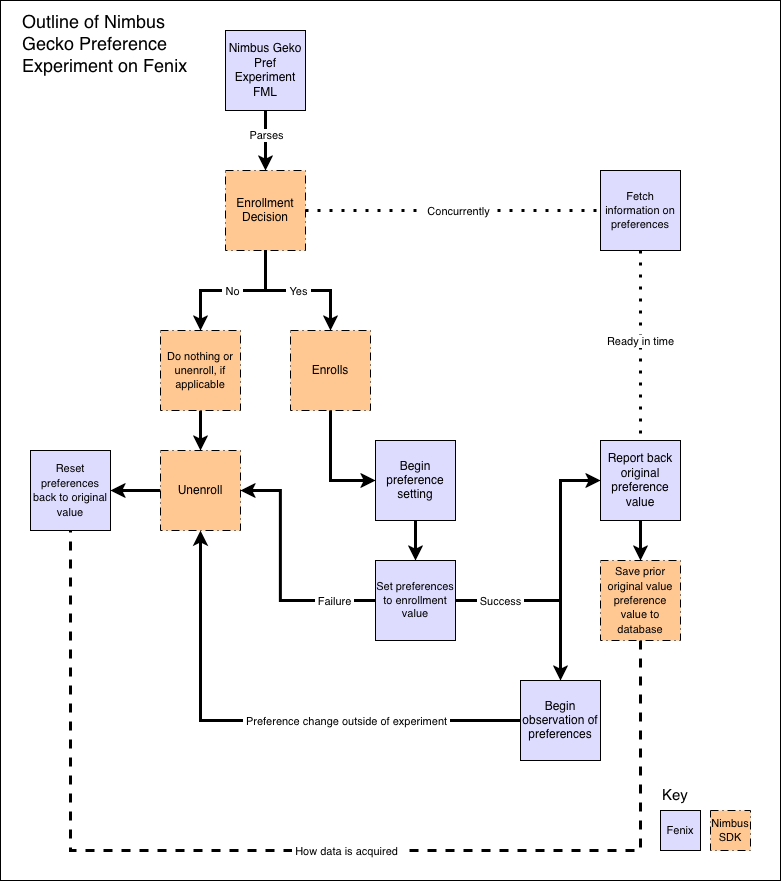

# Nimbus Gecko Preferences Experiments on Fenix

## Overview

The purpose of this document is to provide both technical and general usage information on how a Gecko preferences experiment works on Fenix.

A Gecko preferences experiment is a Nimbus experiment that manipulates a Gecko preference directly. For example, `some-feature.enable` could be a Gecko preference defined in [StaticPrefList.yaml](https://searchfox.org/firefox-main/source/modules/libpref/init/StaticPrefList.yaml)  or [geckoview-prefs.js](https://searchfox.org/firefox-main/source/mobile/android/app/geckoview-prefs.js) or [all.js](https://searchfox.org/firefox-main/source/modules/libpref/init/all.js). (Non-predefined preferences are not currently supported, see [2026350](https://bugzilla.mozilla.org/show_bug.cgi?id=2026350). The supported preference types are `Option<Int>`,`Option<String>`, and `Option<Boolean>`.)

An experiment on Fenix could be setup to manipulate the preference as follows:

In [mobile/android/fenix/app/nimbus.fml.yaml](https://searchfox.org/firefox-main/source/mobile/android/fenix/app/nimbus.fml.yaml):

```
  some-browser-feature:
    description: "Feature in the browser that does xyz."
    variables:
      enable:
        description: "Turn on the feature in the browser."
        type: Option<Boolean>
        gecko-pref:
            pref: "some-feature.enable"
            branch: "user"
      color-change:
        description: "Change the color of the feature."
        type: Option<String>
        gecko-pref:
            pref: "some-feature.color"
            branch: "user"
      timeout:
        description: "Change the timeout to show the feature in milliseconds."
        type: Option<Int>
        gecko-pref:
            pref: "some-feature.timeout"
            branch: "user"
```

Prior to this feature, the standard way of doing an experiment like this would be to define the preference as a formal GeckoView API in [GeckoRuntimeSettings](https://searchfox.org/firefox-main/rev/c836d51da4179d7b456d02d22e2f40c8b1a9b3d7/mobile/android/geckoview/src/main/java/org/mozilla/geckoview/GeckoRuntimeSettings.java#744), propagate it through Application Services, connect it in the app layer in Fenix, and then have that connected to be [controlled by Nimbus](https://searchfox.org/firefox-main/rev/c836d51da4179d7b456d02d22e2f40c8b1a9b3d7/mobile/android/fenix/app/src/main/java/org/mozilla/fenix/components/Core.kt#222).

## Terms

* **Experiment preference value** \- The value the Gecko preference should be set to according to the experiment recipe.
  * **GeckoPrefState** \- Object that holds current and experimental information about the Gecko preference.
* **Original preference value** \- The value of the Gecko preference *before* the experiment value is applied. The value may also be `None` when the *user* did not set the preference beforehand. In that case, the revert request will ask Gecko to set the preference back to the Gecko defined *default* branch value.
  * **PreviousGeckoPrefState / OriginalGeckoPref** \- Object that holds information about the Gecko preference before any experiments occurred.
* **Gecko preference default branch** \- The default value is the base / fallback / original value of the preference. For example, using the toggle button on a set preference in \`about:config\` will cause the preference to revert to this default value. The default value will go into effect immediately *only if*  the user has not changed the preference value.
* **Gecko preference user branch** \- The Gecko preference sets the user value for the preference. The user value will usually immediately go into effect.

## Overview of Flows

### Outline of Nimbus Gecko Preference Experiment on Fenix



There are three key flows occurring in this feature:

* **Enrollment** \- When a valid experiment is ready to set, then Nimbus will request Fenix to set the Gecko preference. There are callbacks and state changes based on whether the Gecko preference setting was successful or not.
* **Unenrollment** \- When an experiment becomes invalidated, for any reason, including disqualification, opt-out, or preference changes, both Nimbus and Fenix need to take action. Nimbus will update the database and mark the experiment as not-active. Fenix will attempt to revert the Gecko preference back to a pre-experiment state.
* **Observation** \- When Gecko preferences involved in an experiment change, then the experiment is no longer valid and unenrollment needs to occur.


The flow begins by parsing the Fenix FML that defines a Gecko preference experiment. The Nimbus SDK will use this information when evaluating enrollment based on many prescribed rules.

If the preference experiment was never enrolled and deemed ineligible, then nothing will happen.

If an existing enrolled Gecko preference experiment is deemed ineligible by Nimbus, then the experiment will be unenrolled and Fenix will attempt to revert the Gecko preference back to the original value. If no original value is available or if the user did not originally have this preference set, then Fenix will request that Gecko revert the preference back to the default value.

If the experiment is valid for enrollment, then the enrollment flow will begin. Nimbus will first enroll the experiment and set it in the database as an enrolled experiment. It will then request the Gecko experiment preference value be set by Fenix.

If Fenix is unsuccessful in setting the Gecko preference, then it will ask Nimbus to unenroll from the experiment (because Nimbus preemptively considered it enrolled).

If Fenix is successful in setting the Gecko preference, then it will report the original value of the preference back to Nimbus and begin observation of the Gecko preference for changes.

When Fenix is observing the preference for changes, if the value ever changes, then Fenix will request unenrollment from the experiment. In a multi-preference experiment that controls multiple Gecko preferences, *any* of the preferences changing will invalidate the experiment. The preference that is observed changing *will not be reverted back to the original value* during unenrollment because it is presumed the user or another Gecko entity changed it on purpose. However, the other preferences in a multi-preference will be reverted back to the original value. Experiments that do not have a preference that changed will not be impacted.

Nimbus will also request Fenix to reset the preference back to the original value if unenrollment occurs at any time during the experiment lifecycle, such as user opt-out.

### Key Areas

* Fenix \- Defines FML \- [nimbus.fml.yaml](https://searchfox.org/firefox-main/source/mobile/android/fenix/app/nimbus.fml.yaml)
* Nimbus \- Enrollment decision \- [enrollment.rs](https://searchfox.org/mozilla-mobile/rev/a1bf8761d514981bda49eca8b3d9d2345b6e0a8e/application-services/components/nimbus/src/enrollment.rs#220)
* Nimbus \- Request information on preferences \- [gecko\_prefs::GeckoPrefStore::initialize](https://searchfox.org/mozilla-mobile/rev/a1bf8761d514981bda49eca8b3d9d2345b6e0a8e/application-services/components/nimbus/src/stateful/gecko_prefs.rs#177)
* Fenix \- Fetch information on preferences \- [NimbusGeckoPrefHandler::getPreferenceStateFromGecko](https://searchfox.org/firefox-main/rev/c836d51da4179d7b456d02d22e2f40c8b1a9b3d7/mobile/android/fenix/app/src/main/java/org/mozilla/fenix/experiments/prefhandling/NimbusGeckoPrefHandler.kt#94)
* Nimbus \- Do not enroll or unenroll \- [enrollment.rs](https://searchfox.org/mozilla-mobile/rev/a1bf8761d514981bda49eca8b3d9d2345b6e0a8e/application-services/components/nimbus/src/enrollment.rs#152,266,303,311,333,809,838)
* Fenix \- Reset preferences back to original value \- [NimbusGeckoPrefHandler::setGeckoPrefsOriginalValues](https://searchfox.org/firefox-main/rev/c836d51da4179d7b456d02d22e2f40c8b1a9b3d7/mobile/android/fenix/app/src/main/java/org/mozilla/fenix/experiments/prefhandling/NimbusGeckoPrefHandler.kt#182)
* Fenix \- Begin experiment preference setting \- [NimbusGeckoPrefHandler::setGeckoPrefsState](https://searchfox.org/firefox-main/rev/c836d51da4179d7b456d02d22e2f40c8b1a9b3d7/mobile/android/fenix/app/src/main/java/org/mozilla/fenix/experiments/prefhandling/NimbusGeckoPrefHandler.kt#235)
* Fenix \- Set preference to enrollment value \- [NimbusGeckoPrefHandler:: applyEnrollmentPrefs](https://searchfox.org/firefox-main/rev/c836d51da4179d7b456d02d22e2f40c8b1a9b3d7/mobile/android/fenix/app/src/main/java/org/mozilla/fenix/experiments/prefhandling/NimbusGeckoPrefHandler.kt#274)
* Fenix \- Report back original preference value \- [NimbusGeckoPrefHandler:: applyEnrollmentPrefs](https://searchfox.org/firefox-main/rev/c836d51da4179d7b456d02d22e2f40c8b1a9b3d7/mobile/android/fenix/app/src/main/java/org/mozilla/fenix/experiments/prefhandling/NimbusGeckoPrefHandler.kt#294)
* Fenix \- Begin observation of preferences \- [NimbusGeckoPrefHandler:: applyEnrollmentPrefs](https://searchfox.org/firefox-main/rev/c836d51da4179d7b456d02d22e2f40c8b1a9b3d7/mobile/android/fenix/app/src/main/java/org/mozilla/fenix/experiments/prefhandling/NimbusGeckoPrefHandler.kt#283)
* Nimbus \- Save prior original preference value to database \- [nimbus\_client::register\_previous\_gecko\_pref\_states](https://searchfox.org/mozilla-mobile/rev/a1bf8761d514981bda49eca8b3d9d2345b6e0a8e/application-services/components/nimbus/src/stateful/nimbus_client.rs#831)

### Key Functions

**nimbus\_client::unenroll\_for\_gecko\_pref** \- Called by the Fenix pref handler when something goes wrong and unenrollment from the experiment needs to occur. The two main conditions under which this function is called are: a) if the pref fails to set (Nimbus assumes the pref set will succeed and considers the experiment enrolled and backs out of it) or b) the app observes the preference changing unexpectedly outside of our control (the experiment became invalid). (Unenrollment flow, Observation flow)

**nimbus\_client::register\_previous\_gecko\_pref\_states** \- Called by Fenix after a successful preference set. This callback tells Nimbus to save the original previous Gecko preference value so that the app may revert back to this value during unenrollment. (Enrollment flow)

**NimbusGeckoPrefHandler::getPreferenceStateFromGecko** \- Called by Fenix during Nimbus initialization to fetch preference information.

**NimbusGeckoPrefHandler::getPrefsWithState** \- Called by Nimbus to get values of Gecko preferences.

**NimbusGeckoPrefHandler::setGeckoPrefsState** \- Called by Nimbus to set an experimental Gecko preference value. (Enrollment flow)

**NimbusGeckoPrefHandler::setGeckoPrefsOriginalValues** \- Called by Nimbus to revert a Gecko preference back to the value prior to the experiment. (Unenrollment flow)

**NimbusGeckoPrefHandler::onPreferenceChange** \- Called by Gecko into Fenix when registered Gecko preferences changes are observed. (Observation flow)

**Code reading tip:** Functions in Rust will follow snake\_case and Kotlin functions will follow camelCase across the uniffi boundary. For example, the Kotlin call may be nimbusApi.value.registerPreviousGeckoPrefStates, which will call into nimbus\_client.rs::register\_previous\_gecko\_pref\_states.

## Technical Stack

### Gecko, GeckoView, and Android Components

Gecko uses and defines the preferences for the feature. Gecko preferences have many layers of legacy, options, and items to keep in mind. Recommend reviewing [nsIPrefBranch.idl](https://searchfox.org/firefox-main/source/modules/libpref/nsIPrefBranch.idl), [StaticPrefList.yaml](https://searchfox.org/firefox-main/source/modules/libpref/init/StaticPrefList.yaml), and [libpref/docs/index.md](https://searchfox.org/firefox-main/source/modules/libpref/docs/index.md).

GeckoView is an opinionated API that exposes features from Gecko for Android specific use. In this case, the [GeckoPreferenceController.java](https://searchfox.org/firefox-main/source/mobile/android/geckoview/src/main/java/org/mozilla/geckoview/GeckoPreferenceController.java) manages sending appropriate preference calls to Gecko in the JS layer through use of the EventDispatcher. It also defines the delegate, onGeckoPreferenceChange, that will produce callbacks for changing preferences.

Android Components is a library that adds a generic browser abstraction over Gecko along with reusable components. The browser engine, which is an abstraction over the Gecko engine for Fenix, implements the [BrowserPreferencesRuntime](https://searchfox.org/firefox-main/source/mobile/android/android-components/components/concept/engine/src/main/java/mozilla/components/concept/engine/preferences/BrowserPreferencesRuntime.kt#20), which in turn uses the GeckoPreferenceController provided by GeckoView to access Gecko preferences. It also defines parts of the [observation](https://searchfox.org/firefox-main/source/mobile/android/android-components/components/browser/engine-gecko/src/main/java/mozilla/components/browser/engine/gecko/preferences/BrowserPrefObserverIntegration.kt) flow.

### Fenix

Fenix defines the experiment in its [nimbus.fml.yaml](https://searchfox.org/firefox-main/source/mobile/android/fenix/app/nimbus.fml.yaml) file that will be processed by the Nimbus SDK. Nimbus is [initialized](https://searchfox.org/firefox-main/rev/c836d51da4179d7b456d02d22e2f40c8b1a9b3d7/mobile/android/fenix/app/src/main/java/org/mozilla/fenix/FenixApplication.kt#284) by Fenix. Fenix is also where the [NimbusGeckoPrefHandler.kt](https://searchfox.org/firefox-main/source/mobile/android/fenix/app/src/main/java/org/mozilla/fenix/experiments/prefhandling/NimbusGeckoPrefHandler.kt) is situated, which implements the [GeckoPrefHandler](https://searchfox.org/mozilla-mobile/rev/0b1e6867b12e996a1668566e44112fe018c7af7d/application-services/components/nimbus/src/stateful/gecko_prefs.rs#128), defined in Nimbus. The NimbusGeckoPrefHandler manages requests from Nimbus relating to Gecko preferences experiments. For example, getting preference information, setting preferences, and observing preferences.

### Application Services and Nimbus

The Nimbus SDK controls the flow of experiment definition, enrollment, unenrollment, and other experiment lifecycle events. For Gecko preference experiments, it makes requests through the [GeckoPrefHandler](https://searchfox.org/mozilla-mobile/rev/0b1e6867b12e996a1668566e44112fe018c7af7d/application-services/components/nimbus/src/stateful/gecko_prefs.rs#128) to reach the Gecko layer and manipulate preferences. The Fenix implementation does this through the [NimbusGeckoPrefHandler](https://searchfox.org/firefox-main/source/mobile/android/fenix/app/src/main/java/org/mozilla/fenix/experiments/prefhandling/NimbusGeckoPrefHandler.kt) which calls out to the [GeckoPreferenceController](https://searchfox.org/firefox-main/source/mobile/android/geckoview/src/main/java/org/mozilla/geckoview/GeckoPreferenceController.java).
